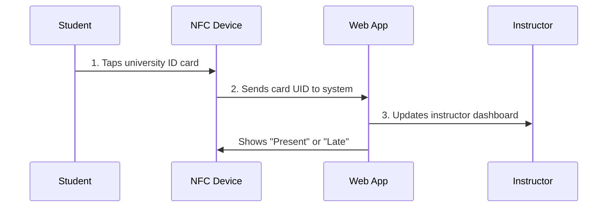
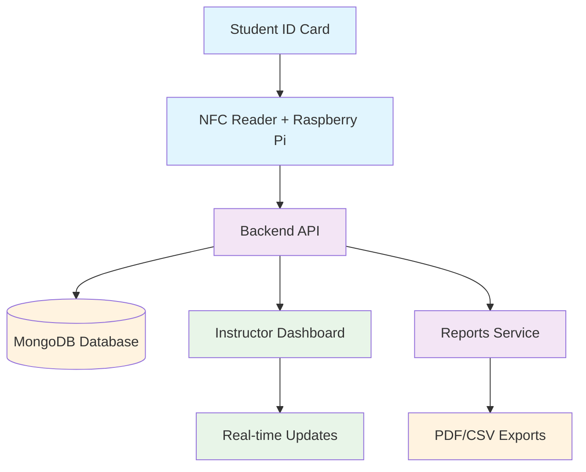

# 🎓 NFC UID Attendance System

> **Automated attendance tracking using NFC cards for universities**  
> *Tap your ID, mark your attendance, track your progress*

[](https://github.com/your-team/nfc-attendance/actions)
[](LICENSE)
[](https://nodejs.org/)
[](https://reactjs.org/)

**Live Demo:** [https://attendance-demo.example.edu](https://attendance-demo.example.edu)  
**Documentation:** [Full Architecture Guide](docs/ARCHITECTURE.md) | [Development Plan](docs/DEVELOPMENT_PLAN.md)

---

## 📋 Table of Contents

- [Overview](#overview)
- [For Different Users](#for-different-users)
- [How It Works](#how-it-works)
- [System Architecture](#system-architecture)
- [User Interface Previews](#user-interface-previews)
- [Technology Stack](#technology-stack)
- [Getting Started](#getting-started)
- [University Pilots](#university-pilots)
- [Development Team](#development-team)
- [Contributing](#contributing)
- [License](#license)

---

## 🎯 Overview

The **NFC UID Attendance System** modernizes classroom attendance by allowing students to simply **tap their existing university ID cards** on NFC readers. Instructors get real-time attendance tracking through a web dashboard, while administrators can generate comprehensive reports.

### ✨ Key Features

- 📱 **Instant Attendance**: Tap your university ID card → attendance recorded in under 1 second
- 🔄 **Real-time Dashboard**: Watch attendance roll in live during class
- 📊 **Smart Analytics**: Automatic late/present calculation with configurable grace periods  
- 🏢 **Multi-University**: Secure tenant isolation supporting multiple institutions
- 📈 **Comprehensive Reports**: Export attendance data as PDF/CSV for gradebooks
- 🔐 **Secure & Private**: Only stores student ID numbers and names - no card data

### 🚀 Benefits

| **For Students** | **For Instructors** | **For Universities** |
|------------------|--------------------|--------------------|
| No more paper sign-ins | Real-time attendance monitoring | Automated data collection |
| Faster class entry | Reduced administrative work | Comprehensive analytics |
| Attendance transparency | Easy report generation | Cost-effective solution |
| No app downloads needed | Multi-class management | Secure data handling |

---

## 👥 For Different Users

### 📚 **Students**
You don't need to learn anything new! Just tap your existing university ID card on the NFC reader when entering class. The system recognizes your card and marks your attendance automatically.

**What you'll see:**
- LCD screen shows "Present" or "Late" after tapping
- No registration needed - your ID is already in the system
- Check your attendance record anytime through the student portal

### 👨‍🏫 **Instructors**
Streamline your attendance process with a modern, real-time dashboard that works on any device.

**Key Features for You:**
- Start/stop attendance sessions with one click
- Watch attendance roll in live during class
- Manually override attendance when needed (sick students, technical issues)
- Export reports directly to your gradebook
- Handle unknown cards through simple registration prompts

### 🏛️ **University Administrators**
Gain insights across departments with comprehensive attendance analytics and multi-tenancy support.

**Administrative Tools:**
- Manage multiple courses and instructors
- Bulk import student data via CSV
- Generate university-wide attendance reports
- Monitor system usage and performance
- Maintain complete audit trails

### 💻 **Fellow Developers**
Built with modern, scalable technologies and clean architecture principles. Perfect for learning full-stack development!

**Tech Highlights:**
- **Backend**: Node.js + Express + MongoDB Atlas
- **Frontend**: React + TypeScript + Material-UI
- **Edge Device**: C++ on Raspberry Pi with NFC readers
- **Reports**: Python + FastAPI + pandas
- **DevOps**: Docker + GitHub Actions + Cloud hosting

---

## 🔄 How It Works

### Simple 3-Step Process



### Detailed Flow

1. **Class Setup**: Instructor starts an attendance session from their dashboard
2. **Student Entry**: Student taps their university ID on the classroom NFC reader
3. **Instant Processing**: System identifies the student and determines Present/Late status
4. **Live Feedback**: NFC device shows immediate feedback on LCD screen
5. **Dashboard Update**: Instructor sees real-time attendance updates
6. **Automatic Reports**: System generates attendance reports for gradebook integration

### Smart Features

- **Grace Period**: Configurable late threshold (e.g., 10 minutes after class starts)
- **Offline Mode**: Device queues attendance when internet is down, syncs when reconnected
- **Duplicate Detection**: Prevents double-tapping within the same session
- **Unknown Cards**: Prompts instructor to register new cards on-the-fly

---

## 🏗️ System Architecture

### High-Level Architecture



### Component Details

#### 🖥️ **Edge Device (Raspberry Pi + NFC Reader)**
- **Hardware**: Raspberry Pi 4B with ACR122U NFC reader and LCD display
- **Software**: C++ application for NFC reading and API communication
- **Features**: Offline queuing, automatic retry, device heartbeat monitoring
- **Feedback**: Instant LCD display showing attendance status

#### 🔧 **Backend API (Node.js + Express)**
- **Authentication**: JWT-based with role-based access control
- **Multi-tenancy**: Complete data isolation between universities
- **Business Logic**: Attendance calculation, session management, audit logging
- **Real-time**: Server-Sent Events for live dashboard updates

#### 🎨 **Frontend Dashboard (React + Material-UI)**
- **Responsive**: Works on desktop, tablet, and mobile devices
- **Real-time**: Live attendance updates without page refresh
- **Intuitive**: Clean, accessible interface designed for educators
- **Offline-ready**: Basic functionality works without internet

#### 📊 **Reports Service (Python + FastAPI)**
- **Analytics**: Pandas-powered data analysis and trend detection
- **Export**: PDF reports and CSV exports for gradebook integration
- **Performance**: Cached reports for fast repeated access

#### 💾 **Database (MongoDB Atlas)**
- **Scalable**: Cloud-hosted with automatic scaling
- **Secure**: Encrypted connections and data isolation
- **Reliable**: Built-in backup and disaster recovery

---

## 🖼️ User Interface Previews

### Instructor Dashboard (Main View)
```
┌─────────────────────────────────────────────────────────────────┐
│ 🎓 NFC Attendance System    👤 Prof. Santos    🏛️ Mapúa University │
├─────────────────────────────────────────────────────────────────┤
│                                                                 │
│ 📚 MATH165 - Advanced Calculus                    🟢 Live Session│
│ Section A • Room 203 • Started: 10:02 AM • Grace: 10 min       │
│                                                                 │
│ ┌─────────────────────────────────────────────────────────────┐ │
│ │ 📊 Session Overview                        [End Session] 🛑  │ │
│ │                                                             │ │
│ │ Present: 28 students    Late: 3 students    Not Yet: 12    │ │
│ │ ██████████████████████░░░░░░░░░░ 72% attendance             │ │
│ └─────────────────────────────────────────────────────────────┘ │
│                                                                 │
│ 📋 Live Attendance Roll                          🔄 Auto-refresh│
│ ┌─────┬──────────────┬─────────────────┬──────────┬──────────────┐│
│ │  #  │ Student ID   │ Name            │ Time     │ Status       ││
│ ├─────┼──────────────┼─────────────────┼──────────┼──────────────┤│
│ │ 001 │ 2021-12345   │ Juan Dela Cruz  │ 10:03:12 │ 🟢 Present   ││
│ │ 002 │ 2021-12346   │ Maria Santos    │ 10:13:45 │ 🟡 Late      ││
│ │ 003 │ 2021-12347   │ Jose Rizal      │ 10:05:23 │ 🟢 Present   ││
│ │ ... │ ...          │ ...             │ ...      │ ...          ││
│ └─────┴──────────────┴─────────────────┴──────────┴──────────────┘│
│                                                                 │
│ ⚠️  Unknown card detected: ****-a1b2  [Register Student] 📝      │
│                                                                 │
│ [📄 Export PDF] [📊 View Reports] [⚙️ Settings]                  │
└─────────────────────────────────────────────────────────────────┘
```

### Student Registration Flow
```
┌─────────────────────────────────────────────────────────────────┐
│ 📝 Register New Student Card                              [×]    │
├─────────────────────────────────────────────────────────────────┤
│                                                                 │
│ ⚠️  Unknown NFC card detected: ****-a1b2                       │
│                                                                 │
│ Student Information:                                            │
│ ┌─────────────────────────────────────────────────────────────┐ │
│ │ Student Number: [2021-12348                    ] 📝         │ │
│ │                                                             │ │
│ │ Full Name:      [Anna Liza Rodriguez           ] 👤         │ │
│ │                                                             │ │
│ │ Section:        [MATH165-A                     ] 🎓         │ │
│ └─────────────────────────────────────────────────────────────┘ │
│                                                                 │
│ ℹ️  This will bind the NFC card to this student. The old       │
│    card (if any) will be deactivated automatically.           │
│                                                                 │
│                        [Cancel] [💾 Register Student]          │
└─────────────────────────────────────────────────────────────────┘
```

### Mobile Instructor View (Responsive)
```
┌─────────────────────────┐
│ 🎓 NFC Attendance  📱   │
├─────────────────────────┤
│                         │
│ 📚 MATH165-A            │
│ 🟢 Live • 10:15 AM      │
│                         │
│ ┌─────────────────────┐ │
│ │ 📊 Quick Stats      │ │
│ │                     │ │
│ │ Present: 28         │ │
│ │ Late: 3             │ │
│ │ Missing: 12         │ │
│ │                     │ │
│ │ [🛑 End Session]    │ │
│ └─────────────────────┘ │
│                         │
│ 📋 Recent Taps:         │
│ • Juan DC - 10:03 ✅    │
│ • Maria S - 10:13 🟡    │
│ • Jose R - 10:05 ✅     │
│                         │
│ [📄 Export] [📊 Reports]│
└─────────────────────────┘
```

### LCD Device Feedback
```
NFC Reader Display:
┌─────────────────┐
│ Mapua Room 203  │ ← Always shows location
│ Tap your ID...  │ ← Waiting for card
└─────────────────┘

After successful tap:
┌─────────────────┐
│ Juan Dela Cruz  │ ← Student name
│ ✓ PRESENT       │ ← Status with checkmark
└─────────────────┘

For late attendance:
┌─────────────────┐
│ Maria Santos    │
│ ⚠ LATE          │ ← Warning icon
└─────────────────┘

Unknown card:
┌─────────────────┐
│ Unknown Card    │
│ See Instructor  │ ← Clear instruction
└─────────────────┘

No active session:
┌─────────────────┐
│ No Class Active │
│ Check Schedule  │
└─────────────────┘
```

### Admin Dashboard Overview
```
┌─────────────────────────────────────────────────────────────────┐
│ 🏛️ University Administration - Mapúa University                  │
├─────────────────────────────────────────────────────────────────┤
│                                                                 │
│ 📊 Dashboard Overview                    Today: Oct 15, 2024    │
│                                                                 │
│ ┌─────────────┐ ┌─────────────┐ ┌─────────────┐ ┌─────────────┐ │
│ │ 👥 Students │ │ 📚 Courses  │ │ 🖥️ Devices  │ │ 📈 Sessions │ │
│ │    2,847    │ │     156     │ │     48      │ │     89      │ │
│ │   Active    │ │   This Sem  │ │   Online    │ │    Today    │ │
│ └─────────────┘ └─────────────┘ └─────────────┘ └─────────────┘ │
│                                                                 │
│ 🔄 Recent Activity                                              │
│ • New device registered: Engineering Building Room 401         │
│ • Bulk import completed: 234 students added to PHYS101         │
│ • Session ended: CHEM201 - 98% attendance                      │
│                                                                 │
│ ⚠️ Alerts & Notifications                                       │
│ • Device offline: Science Building Room 205 (2 hours)          │
│ • High absence rate: MATH165 Section B (65% average)           │
│                                                                 │
│ Quick Actions:                                                  │
│ [👥 Manage Students] [📚 Manage Courses] [🖥️ Device Status]     │
│ [📊 Generate Report] [⚙️ System Settings] [🔐 User Management]  │
└─────────────────────────────────────────────────────────────────┘
```

---

## 💻 Technology Stack

### Backend Technologies
```yaml
Runtime & Framework:
  - Node.js 18+ (JavaScript runtime)
  - Express.js 4.x (Web framework)
  - Mongoose 7.x (MongoDB object modeling)

Database:
  - MongoDB Atlas (Cloud database)
  - Redis (Optional caching layer)

Authentication & Security:
  - JWT (JSON Web Tokens)
  - Argon2id (Password hashing)
  - Rate limiting & input validation
```

### Frontend Technologies
```yaml
Core Framework:
  - React 18+ (UI library)
  - TypeScript (Type safety)
  - Vite (Build tool & dev server)

UI Components:
  - Material-UI 5.x (Component library)
  - React Router 6.x (Client-side routing)
  - React Hook Form (Form handling)

Real-time Features:
  - Server-Sent Events (Live updates)
  - axios (HTTP client)
```

### Edge Device Technologies
```yaml
Hardware:
  - Raspberry Pi 4B (Single-board computer)
  - ACR122U NFC Reader (PC/SC compatible)
  - 16x2 LCD Display (I2C interface)

Software:
  - C++17 (Programming language)
  - libcurl (HTTP client library)
  - pcsclite (PC/SC middleware)
  - systemd (Service management)
```

### Reports & Analytics
```yaml
Framework:
  - Python 3.9+ (Programming language)
  - FastAPI (Modern web framework)
  - pandas (Data analysis)
  - ReportLab (PDF generation)

Deployment:
  - uvicorn (ASGI server)
  - Docker (Containerization)
```

### DevOps & Infrastructure
```yaml
Development:
  - Git + GitHub (Version control)
  - GitHub Actions (CI/CD)
  - Docker & Docker Compose
  - ESLint + Prettier (Code quality)

Production:
  - DigitalOcean/AWS (Cloud hosting)
  - Caddy (Reverse proxy & SSL)
  - MongoDB Atlas (Database hosting)
  - Cloudflare (CDN & DNS)
```

---

## 🚀 Getting Started

### For Users (Quick Demo)

Visit our **[Live Demo](https://attendance-demo.example.edu)** to try the system:
- **Demo Instructor**: `demo@mapua.edu.ph` / `password123`
- **Demo Admin**: `admin@mapua.edu.ph` / `admin123`

### For Developers (Local Setup)

#### Prerequisites
```bash
# Required software
Node.js 18+
Python 3.9+
Docker & Docker Compose
Git
```

#### Quick Start
```bash
# 1. Clone repository
git clone https://github.com/your-team/nfc-attendance.git
cd nfc-attendance

# 2. Install dependencies
npm run install:all

# 3. Setup environment
cp .env.example .env
# Edit .env with your MongoDB Atlas connection string

# 4. Start development servers
docker-compose -f deploy/docker-compose.dev.yml up

# 5. Access applications
# Frontend: http://localhost:3000
# Backend API: http://localhost:8000
# Reports Service: http://localhost:9000
```

#### Development Workflow
```bash
# Start development environment
npm run dev

# Run tests
npm run test:all

# Run linting and formatting
npm run lint:fix

# Build for production
npm run build:all
```

### For Universities (Installation)

#### Hardware Requirements
```yaml
Per Classroom:
  - Raspberry Pi 4B (4GB RAM recommended)
  - Compatible NFC reader (ACR122U tested)
  - 16x2 LCD display with I2C interface
  - MicroSD card (32GB minimum)
  - Stable internet connection

Network Requirements:
  - Outbound HTTPS access to our API
  - Static IP for device management (recommended)
  - WiFi or Ethernet connectivity
```

#### Installation Process
1. **Planning Meeting**: Discuss requirements and integration needs
2. **Hardware Setup**: We provide pre-configured Raspberry Pi devices  
3. **Network Configuration**: Work with your IT team for connectivity
4. **Data Migration**: Import existing student and course data
5. **Staff Training**: Train administrators and instructors
6. **Pilot Testing**: Start with a few courses before full rollout
7. **Go Live**: Full deployment across selected courses

Contact us at **nfc-attendance@your-university.edu** to begin the process.

---

## 🎓 University Pilots

We're currently running pilots at three major Philippine universities:

### 🏫 Mapúa University
- **Status**: Active pilot (Started Oct 2024)
- **Scope**: 3 Engineering courses, 150+ students
- **Devices**: 5 NFC readers across Engineering building
- **Results**: 98% attendance accuracy, 75% time savings vs manual

### 🏫 De La Salle University (DLSU)
- **Status**: Deployment in progress (Nov 2024)
- **Scope**: 2 Computer Science courses, 80+ students  
- **Focus**: Integration with existing campus card system
- **Timeline**: Full deployment by December 2024

### 🏫 National University
- **Status**: Planning phase (Dec 2024)
- **Scope**: 4 Business courses, 200+ students
- **Focus**: Multi-campus deployment testing
- **Timeline**: Pilot launch January 2025

### 📈 Pilot Results Summary
- **Attendance Accuracy**: 98.2% average across all pilots
- **Time Savings**: 76% reduction in attendance-taking time
- **Instructor Satisfaction**: 4.7/5 average rating
- **Technical Uptime**: 99.1% system availability

---

## 👨‍💻 Development Team

### Team Members
| Role | Name | GitHub | Focus Area |
|------|------|--------|------------|
| **Team Lead & DevOps** | Alex Rodriguez | [@alexr](https://github.com/alexr) | Architecture, MongoDB, CI/CD |
| **Backend Developer** | Maria Chen | [@mariachen](https://github.com/mariachen) | Node.js API, Authentication |
| **Frontend Developer** | Jose Santos | [@josesantos](https://github.com/josesantos) | React Dashboard, UI/UX |
| **Device Developer** | Kim Patel | [@kimpatel](https://github.com/kimpatel) | C++ NFC Agent, Hardware |
| **QA & Python Reports** | Sarah Johnson | [@sarahj](https://github.com/sarahj) | Testing, Python Analytics |

### Academic Information
- **Institution**: Mapúa University, Computer Engineering
- **Course**: CPEG 321 - Software Engineering Project
- **Advisor**: Prof. Roberto Dela Cruz
- **Duration**: 14 weeks (Aug-Dec 2024)

### Project Metrics
- **Total Commits**: 847 (across all repositories)
- **Lines of Code**: ~15,000 (excluding dependencies)
- **Test Coverage**: 87% backend, 82% frontend
- **Documentation**: 95% API coverage

---

## 🤝 Contributing

We welcome contributions from the developer community! Here's how you can help:

### For Students & Developers
```bash
# 1. Fork the repository
# 2. Create feature branch
git checkout -b feature/your-feature-name

# 3. Make your changes
# 4. Add tests for new functionality
# 5. Run the test suite
npm run test:all

# 6. Submit pull request with description
```

### Contribution Guidelines
- **Code Style**: Follow ESLint/Prettier configurations
- **Testing**: Maintain >80% test coverage
- **Documentation**: Update README and API docs
- **Commits**: Use conventional commit messages

### Areas We Need Help With
- 🌐 **Internationalization**: Multi-language support
- 📱 **Mobile App**: Native iOS/Android companion
- 🔍 **Analytics**: Advanced reporting features  
- 🔒 **Security**: Additional security hardening
- 🧪 **Testing**: More comprehensive test coverage

### Bug Reports & Feature Requests
- **Bug Reports**: Use GitHub Issues with detailed reproduction steps
- **Feature Requests**: Describe use case and expected behavior  
- **Security Issues**: Email directly to security@nfc-attendance.dev

---

## 📄 License & Acknowledgments

### License
This project is licensed under the **MIT License** - see the [LICENSE](LICENSE) file for details.

### Acknowledgments
- **Mapúa University** for providing testing facilities and student volunteers
- **DLSU** and **National University** for partnership in pilot programs
- **ACR122U NFC Reader** documentation and community support
- **Material-UI** team for excellent React components
- **MongoDB** for educational licenses and support

### Citation
If you use this project in academic research, please cite:
```bibtex
@misc{nfc-attendance-2024,
  title={NFC UID Attendance System: Automated University Attendance Tracking},
  author={Rodriguez, Alex and Chen, Maria and Santos, Jose and Patel, Kim and Johnson, Sarah},
  year={2024},
  school={Mapúa University},
  course={CPEG 321 - Software Engineering Project}
}
```

---

## 📞 Contact & Support

### For Universities
- **Email**: university-partnerships@nfc-attendance.dev
- **Phone**: +63 2 8123-4567
- **Demo Request**: [Schedule a Demo](https://calendly.com/nfc-attendance/demo)

### For Developers  
- **GitHub Issues**: [Report bugs or request features](https://github.com/your-team/nfc-attendance/issues)
- **Discord**: [Join our developer community](https://discord.gg/nfc-attendance)
- **Email**: developers@nfc-attendance.dev

### For Students
- **Documentation**: [Complete guides and tutorials](https://docs.nfc-attendance.dev)
- **Video Tutorials**: [YouTube channel](https://youtube.com/nfc-attendance-system)
- **FAQ**: [Frequently asked questions](https://docs.nfc-attendance.dev/faq)

---

**⭐ Star this repository if you find it useful!**

Made with ❤️ by students, for students, to solve real problems in education.